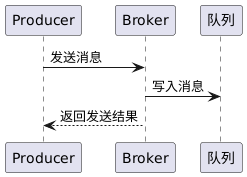
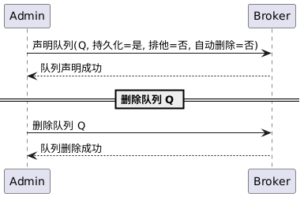
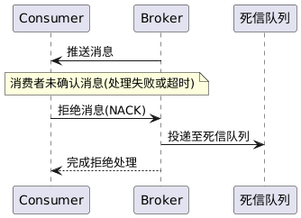
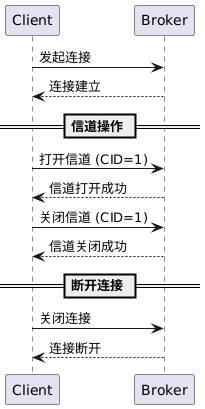
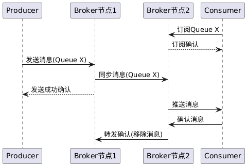

# 轻量级消息队列系统 软件需求规格说明与设计文档

## 1 引言

本章节介绍本轻量级消息队列系统的背景、专业术语、目标和读者对象。

**1.1 背景**
消息队列是分布式系统中常用的组件，用于实现异步解耦、流量削峰和平滑通信。本项目为一个轻量级的消息队列系统（以下简称 **2025MQ**），提供基本的发布/订阅消息通信功能。该系统受到 RabbitMQ 等消息中间件的启发，采用 C++ 实现，旨在在功能完整性的基础上保持较低的复杂度和资源开销。系统支持多种消息通信模式，包括点对点的简单路由、基于主题的过滤路由、广播发布/订阅，以及消息确认和持久化等特性，同时考虑扩展到集群模式以提高可靠性和扩展性。

**1.2 术语定义**
为方便阐述，下面对文档中涉及的专有名词进行定义说明：

* **生产者（Producer）**：发送消息的客户端应用程序。生产者将消息发布到消息队列系统，由系统负责路由和传递。
* **消费者（Consumer）**：接收消息的客户端应用程序。消费者从消息队列系统中订阅并获取消息进行处理。
* **代理服务器/消息代理（Broker）**：消息队列服务器端，用于接收、存储、路由和转发消息。Broker 为生产者和消费者提供统一的通信接口。
* **信道（Channel）**：建立在客户端连接之上的虚拟通信通道。一个物理连接可包含多个信道，支持并行的消息收发会话，避免频繁创建连接。
* **消息（Message）**：由生产者发送、消费者接收的数据单元，通常包含消息体（业务数据）和属性（如消息ID、路由键、持久化标志等）。
* **消息队列（Queue）**：用于存储消息的缓冲队列，按照先入先出的原则临时保存消息，直到被消费或过期。每个队列有唯一标识名称，支持持久化存储配置。
* **交换机（Exchange）**：用于根据路由规则将生产者发送的消息分发到一个或多个队列的路由组件。交换机根据类型和绑定键决定消息流向。类型包括:

  * *Direct*（直连交换机）：按照精确匹配路由键将消息路由到绑定了相同键的队列。
  * *Fanout*（扇出交换机）：将消息广播到所有与该交换机绑定的队列，忽略路由键。
  * *Topic*（主题交换机）：根据路由键的模式（通配符\*、#）匹配，将消息路由到符合绑定模式的队列，实现主题过滤。
* **绑定（Binding）**：交换机和队列之间的关联关系。绑定包含一个绑定键，用于描述队列对交换机所发布消息的路由键过滤规则。通过绑定，交换机可以依据消息的路由键将消息定向投递到相应的队列。
* **路由键（Routing Key）**：生产者在发布消息时指定的字符串，用于描述消息主题或类别。交换机依据路由键和绑定键的匹配关系来决定消息投递的目标队列。
* **绑定键（Binding Key）**：在将队列绑定到交换机时指定的字符串，用于描述该队列感兴趣的消息路由键模式。Direct 类型交换机下绑定键要求与路由键完全相等；Topic 类型下支持通配符匹配（`*`匹配一个单词，`#`匹配零个或多个单词）。
* **持久化消息（Durable Message）**：指在消息存储和传输过程中具有持久特性的消息。如果队列被声明为持久化，投递到该队列的消息可选择标记为持久化，此类消息将写入磁盘以保证代理重启后仍可恢复。非持久化消息仅存储在内存中，系统重启或故障时会丢失。
* **确认（Acknowledgement，Ack）**：消费者收到消息后向Broker发送的确认信号，表示该消息已被成功处理。Broker 收到确认后可将该消息从队列（尤其是持久化存储）中删除。如果开启了手动确认模式，消费者必须显式发送确认；自动确认模式下系统在发送后立即视为确认。
* **死信（Dead Letter）**：无法被正常消费的消息（例如多次投递未被确认、过期或被消费者拒绝的消息）可被Broker判定为死信。死信可以根据策略被路由到特殊的**死信队列（Dead Letter Queue, DLQ）**，以供监控和后续处理。
* **虚拟主机（Virtual Host）**：逻辑上的消息命名空间，用于隔离不同应用的交换机、队列命名。每个虚拟主机下可建立各自的交换机、队列集合。本系统使用单一虚拟主机`MyVirtualHost`来管理所有队列和交换机。
* **集群（Cluster）**：由多台Broker服务器节点组成的整体，对外表现为单一消息队列服务。集群模式下，各节点协同存储和转发消息，实现数据冗余备份和负载均衡。典型模式如主从复制：一台主节点接收并广播消息到从节点，使所有节点状态同步。消费者可连接任意节点读取消息。

**1.3 文档目标概述**
本文档按照 IEEE 软件需求规格说明（SRS）的标准结构，详细阐述 2025MQ 系统的需求和设计，包括系统功能描述、模块设计以及关键交互流程。文档的目标在于帮助读者理解该消息队列系统提供的功能特性、内部工作原理和设计决策。我们将围绕系统的 12 项核心功能分别给出需求说明，并通过 UML 图对系统架构和交互进行建模，以确保设计的清晰和完整。

**1.4 读者对象**
本说明文档面向以下读者：

* **开发人员**：希望了解系统需求、设计方案以便参与开发或二次开发的工程师。
* **测试人员**：需要根据需求规格验证系统功能完整性和正确性的测试工程师。
* **维护人员**：负责系统部署、运维的工程师，了解系统特性以保证稳定运行。
* **项目相关者**：对消息队列系统原理和功能感兴趣，希望评审或采用本系统的人员。

通过阅读本档，读者应能够了解2025MQ的功能范围和设计细节，包括消息如何在系统内流转、系统如何保证消息可靠性，以及系统组件如何交互协同等。

## 2 整体描述

本章节对消息队列系统的整体情况进行描述，包括系统功能概览、用户角色特征以及相关假设和依赖。

**2.1 系统功能概览**
2025MQ 系统提供一个轻量级的消息中间件平台，核心功能可以概括如下：

* **基本消息收发**：支持生产者发送消息、消费者订阅接收消息，实现异步通信。
* **队列与交换机管理**：允许创建和删除消息队列，支持多种类型的交换机声明及解绑/绑定操作，实现灵活的消息路由拓扑。
* **消息路由与过滤**：通过路由键匹配和绑定机制，将消息根据Direct/Fanout/Topic等模式投递到一个或多个目标队列，实现点对点、一对多广播及按主题过滤的发布订阅。
* **消息持久化**：可配置消息队列为持久队列，使消息存储到磁盘文件，防止代理服务器重启或崩溃时消息丢失。
* **消费确认与死信处理**：支持消费者对消息处理结果进行确认（ACK）。未被确认的消息可重新投递或判定为死信路由到死信队列，以保证消息不被无故丢弃。
* **客户端连接管理**：Broker 支持多客户端并发连接，维护每个连接下的会话信道，确保多路通信。能够检测并管理连接建立、终止等状态。
* **管理接口**：提供查询服务器状态的管理指令，例如列出当前存在的交换机、队列及它们之间的绑定关系，方便运维监控。
* **集群扩展**：预留集群模式设计，以便在多节点部署时实现消息的复制和高可用。虽然当前版本为单机运行，设计上考虑了扩展到主从集群的方案。

**2.2 用户特征**
系统直接用户可以分为以下两类：

* **消息生产者**：负责向消息队列系统发布消息的应用或服务。生产者通常关注发送操作的可靠性（如确认发送成功）以及消息是否需要持久化存储等。
* **消息消费者**：负责从消息队列系统接收和处理消息的应用或服务。消费者关注如何订阅目标队列、消费到消息的顺序和频率，以及处理完消息后的确认或拒绝机制。
  此外，**系统管理员** 作为特殊用户角色，可能通过管理接口或配置文件对系统进行运维管理，包括创建/删除资源（交换机、队列）、监控消息堆积、配置集群等。管理员通常有较高权限，可以查看和操作所有资源，以保证系统正常运行。

用户与系统交互主要通过客户端程序提供的命令或API来完成。例如，生产者和消费者均通过调用客户端库的方法（或命令行指令）与 Broker 建立连接、打开信道，然后执行发布、订阅等具体操作。系统为不同角色的用户提供了一致的网络接口（基于 TCP 和 Protobuf 协议），生产者和消费者只需遵循相应消息格式即可与 Broker 通信。

**2.3 假设与依赖**

* **运行环境**：假定 Broker 服务器运行在类 UNIX 环境（例如 Linux），依赖于 **Muduo** 网络库提供高效的事件驱动 TCP 通信，以及 **Google Protocol Buffers** 作为消息编码协议。编译运行需要相应的C++开发环境及第三方库依赖。
* **持久化存储**：系统将持久化消息存储在本地文件系统中（如当前目录下的数据文件），无需依赖外部数据库。假定部署服务器具备可靠的磁盘存储空间。默认数据文件路径为部署目录下`/meta.db`（用于元数据）及若干`.mqd`队列文件存储消息。
* **网络与连接**：假定生产者和消费者通过可靠的网络与 Broker 通信。单个Broker节点监听固定端口（默认为 8085）接受 TCP 连接。需要保证网络连接的稳定，超时和断线时系统会相应地清理资源。
* **时序及时钟**：假设Broker服务器和客户端的系统时间准确且同步，用于日志和可能的消息过期判断。当前实现并未严格依赖同步时钟，但在集群模式设计中假定各节点时间一致。
* **集群部署**：如果启用集群模式，假定各 Broker 节点之间的网络畅通，带宽和延迟满足消息复制要求。还假定只有一个主节点负责接受客户端的写入（根据设计，可扩展为多主，但此处按主从设计），从节点仅同步数据和提供读取，提高可用性。
* **故障与恢复**：持久化功能假设磁盘故障机率极低，在Broker异常退出或重启后，持久化队列中的消息能够从磁盘文件正确恢复。集群模式假定不会出现脑裂等严重一致性问题——若主节点故障，需人工或通过外部协调服务选举新的主节点。


## 3 具体需求

本章节按照系统的12项核心功能要求，逐一详细描述每项功能的需求。每个功能点将包括该功能的**输入**（触发条件或输入数据）、**处理**（系统内部执行的逻辑）和**输出**（预期的系统行为或响应）。

### 3.1 消息发送

* **输入:** 生产者客户端提出发送消息请求，指定目标交换机名称（或默认交换机）、路由键（如果交换机类型需要）以及消息内容。消息可以包含额外属性，如消息ID（若未提供则由系统生成）、是否持久化投递等。
* **处理:** Broker 接收到发送请求后，首先验证目标交换机是否存在；若不存在，则返回错误响应给生产者（发送失败）。如果交换机有效，Broker 将根据该交换机的类型和提供的路由键，确定目标队列（或多个队列）。对于 Direct 类型交换机，将寻找绑定键与路由键精确匹配的队列；Fanout 类型则选取所有绑定此交换机的队列；Topic 类型则计算哪些绑定模式能够匹配当前路由键的队列集合。然后，Broker 会将消息投入每一个目标队列中：在将消息写入队列时，如该队列配置为持久化且消息要求持久化，Broker 将在将消息加入内存队列的同时将其写入磁盘文件保存。消息进入队列后，如果该队列有消费者订阅，Broker 将立即触发消息投递流程（参见**3.2 消息接收**）。
* **输出:** 如果消息成功路由到至少一个队列，Broker 将发送确认响应给生产者客户端，告知消息发送成功。对于不需要确认的发送（如自动模式），生产者也可选择不等待确认直接进行下一次发送。若发送过程中出现问题（如目标交换机不存在，或路由键找不到任何匹配队列且系统配置为必须投递），Broker 将返回发送失败的错误信息。发送操作完成后，消息应已在目标队列中等待被消费或已投递给消费者，生产者端则结束此次发送请求。

### 3.2 消息接收

* **输入:** 消费者客户端向Broker发出订阅请求，指定要订阅的目标队列名称，并选择是否自动确认模式（auto\_ack）等参数。订阅请求通常通过打开的信道发送，可以携带一个消费者标签以标识该订阅会话。
* **处理:** Broker 收到订阅请求后，执行以下处理：首先验证指定的队列是否存在；如果不存在该队列，则返回错误（订阅失败）。若队列存在，Broker 在该队列上登记一个消费者监听实例（即将消费者加入该队列的消费者列表）。随后Broker向该消费者发送订阅确认响应，表示订阅成功、生效。从此刻开始，Broker 会监视该队列中是否有可用消息。如果订阅发生时队列中已有未消费消息，Broker 将立即尝试向新订阅的消费者投递这些积压的消息（通常按照先进先出的顺序逐条发送）。如果队列当时为空，Broker则等待新消息的到来。当有生产者投递新消息到该队列时，Broker 检测到该队列存在活跃消费者订阅，便立即从队列取出一条消息，通过网络将消息推送给消费者。对于具有多个消费者订阅同一队列的情形，Broker 将按照轮询（Round Robin）方式选择一个消费者进行投递，以实现负载均衡。
* **输出:** 消费者客户端会收到来自Broker的订阅结果响应，指示订阅成功与否。订阅成功后，消费者进入等待接收消息的状态。**输出**主要体现为Broker向消费者持续异步发送消息：每当有符合条件的新消息到达或队列中有积压消息，Broker即刻将消息内容（包括属性，如消息ID、路由键等）封装为消息传送协议格式发送给消费者。消费者收到消息即表示接收成功，然后可以进行本地处理。若消费者设置为自动确认模式，则Broker在发送完消息后将立即将其标记为已消费并从队列移除，无需等待消费者回复ACK；若为手动确认模式，消息将暂时处于“待确认”状态，直到收到消费者的确认（参见**3.5 消息确认**）。在消费者取消订阅或断开连接之前，Broker将持续负责向其传递队列中的新消息。

### 3.3 队列管理

* **输入:** 管理用户或客户端（可以是生产者/消费者程序在适当时机执行）请求创建或删除一个消息队列。创建队列（声明队列）请求包含队列名称及其属性参数，例如：是否持久化`durable`、是否排他`exclusive`（仅当前连接可见，连接断开后自动删除）、是否自动删除`auto_delete`（当队列上无消费者时自动删除）等，以及可扩展的其他参数（args）。删除队列请求则提供目标队列名称，要求Broker将其移除。
* **处理:** Broker 对于**声明队列**请求，执行以下步骤：检查欲创建的队列名称是否已存在。如已存在并属性不冲突，则直接认为声明成功（类似幂等操作）；如已存在但属性与请求不符，则返回错误避免冲突；如果不存在，则在Broker的虚拟主机中创建该队列的数据结构，并保存其元数据。如果该队列被标记为持久化，Broker会在元数据存储（例如`meta.db`文件）中记录该队列信息，以便 Broker 重启时恢复队列。随后Broker初始化与该队列关联的消息存储模块（为持久化队列创建对应的消息文件，以及在内存中建立消息列表结构）。此外，Broker还在消费者管理模块中为新队列建立一个空的消费者列表，准备接受订阅。对于**删除队列**请求，Broker首先检查该队列是否存在；若不存在直接返回成功或提示不存在（防止错误操作），若存在则执行删除流程：确保该队列上没有未消费的消息和活动的消费者（或强制解除消费者订阅），然后删除内存中队列对象，从元数据中移除该队列信息并删除该队列的持久化消息文件，释放其所有资源。如果队列上仍有关联的交换机绑定关系，Broker在删除队列时应当同步移除这些绑定，以防出现悬空引用。
* **输出:** 对于队列声明操作，Broker返回操作结果给请求端：成功时返回队列创建成功的确认消息（如果请求者是应用程序则可能无需特殊处理，命令行模式下会有提示），其中可包含队列的实际属性（如队列名、是否持久化等）；失败时返回错误原因（例如命名冲突或参数不合法）。对于删除队列操作，Broker返回队列删除成功的确认。如果删除时队列不存在或已被删除，Broker可返回一个警告或信息提示，但认为操作幂等成功。成功删除后，后续对该队列的发送或订阅请求将被拒绝（队列不存在）。通过这些管理操作，用户能够动态管理Broker中的消息队列生命周期，满足应用在运行期间对队列资源的需求变化。

### 3.4 消息持久化

* **输入:** 生产者在发送消息或管理员在创建队列时，可能指定需要消息持久化的要求：具体而言，当生产者发送消息时，可以在消息的属性中设置消息的投递模式（Delivery Mode）为持久；或者队列在声明时被标记为持久化队列（Durable Queue）。满足这两个条件时，消息应被视为需要持久化存储。输入触发可以是：生产者发送的消息属性包含`delivery_mode=DURABLE`，且目标队列为持久队列。
* **处理:** Broker 在收到一条需要持久化的消息并将其路由到某持久化队列时，会在将消息加入内存队列的同时，将该消息追加写入对应队列的持久化存储文件（例如以队列名命名的`.mqd`文件）。系统对每条持久化消息保存完整的数据，包括消息属性（如ID、路由键、持久化标志等）和消息内容主体，并在文件中标记该消息为“有效”。写入磁盘成功后，Broker才会认为该消息已持久保存。如果文件写入失败（例如磁盘错误），Broker将记录错误日志并可能向生产者返回发送失败，以确保不丢弃消息。对于持久化的队列，Broker在启动时会扫描其消息文件，恢复尚未确认的消息：具体做法是读取文件中所有标记为有效的消息记录，将它们加载到内存队列尾部，继续等待投递。这意味着即使Broker异常重启，之前持久化的消息不会丢失，系统能够延续未完成的消息传递过程。此外，在消息确认后，Broker会将对应消息标记为“无效”并从文件中逻辑删除（通过置标志位）的方式进行“懒删除”，后续通过文件压缩/垃圾回收机制（如当无效数据占比过高时）来真正回收磁盘空间。
* **输出:** 对于生产者而言，持久化消息的输出表现为可靠性提升：Broker 在确认发送成功时意味着消息已安全写入磁盘，因此生产者可以得到保证——即使Broker随后发生崩溃，消息仍可在其恢复后继续存在于队列中等待消费。Broker 在发送确认响应中并不会区分消息是否持久化成功（除非出现错误情形会返回失败）；对管理员而言，通过管理接口可查看持久化队列的消息数量等状态。如果发生持久化相关错误，Broker将输出错误日志并可以通过管理查询接口呈现（例如某队列持久化文件无法写入）。总的来说，消息持久化功能确保**输出**行为符合“至多投递一次或持久存储”的语义：对设置为持久的消息，系统保证其要么被消费并确认，要么持久保存在存储介质中，不会因为Broker进程退出而丢失。

### 3.5 消息确认

* **输入:** 消费者客户端收到并处理完一条消息后，向Broker发送消息确认请求（ACK）。该请求一般包含消费的队列名称和消息的唯一ID，以便Broker识别哪条消息被确认。只有在**手动确认模式**下，消费者才需要显式发送ACK；如果消费者订阅时指定`auto_ack=true`，则不需要发送确认，Broker会自动认为消息已确认。除了正常确认，也存在消费者拒绝确认的情况（通常称为NACK或Reject），将在死信队列功能中描述。
* **处理:** Broker 收到消费者的确认请求后，根据其中的消息ID和队列名称定位对应的消息。在Broker内部，该消息此前处于该队列的“等待确认”列表中（消息已发送给消费者但尚未确认）。处理流程如下：Broker检查消息ID是否在该消费者对应队列的待确认列表中：如果是，则将其从待确认列表移除，表示消费者已成功处理该消息。随后Broker从队列的存储中删除该消息的数据：对于非持久化消息，仅从内存队列移除即可；对于持久化消息，Broker需要更新其在持久化文件中的状态（将其标记为无效，表示已消费）。为了效率，Broker通常采用懒删除——仅标记无效但暂不立即重写文件，定期触发文件压缩整理无效记录。确认处理完成后，该消息彻底从Broker中消失，不会再投递给其他消费者。这一过程需要加锁以确保线程安全（Broker可能在多线程环境下工作）。如果Broker收到一个无法识别的消息确认（例如消息已被确认过或者ID不存在），Broker将忽略该ACK并可能记录警告日志。
* **输出:** Broker 对消费者发送的确认请求作出响应。根据协议设计，Broker可能发送一个通用确认响应（basicCommonResponse）给消费者以表示ACK已处理。如果使用命令行客户端，消费者也可能在界面上看到确认发送成功的提示。更重要的**输出**是系统状态的改变：被确认的消息从队列中移除，队列的消息计数（包括待消费消息数和未确认消息数）都会相应减少。管理员通过管理接口查询队列状态时，可发现队列长度减少。对于持久化消息，确认之后在磁盘文件中标记为无效，不再占用有效消息计数。消息确认机制保证了消息至少处理一次的语义：在开启手动确认情况下，只有收到消费者ACK，Broker才会认为消费成功，否则可将消息重新投递或转为死信（见**3.6 死信队列**）。因此，正确处理ACK是保证消息不丢不重的重要环节。

### 3.6 死信队列

* **输入:** 当出现以下情况之一时，一条消息会被Broker视为死信候选：消费者显式拒绝（Reject/NACK）这条消息并且要求不重新投递；消息在队列中滞留超过其TTL（生存时间，如果有设置过期时间）；或者消息经过一定次数重新投递仍未被确认（可选策略）。特别地，消费者通过客户端发送**拒绝消息**请求（通常包含消息ID，可能还有是否放回队列的标志）是触发死信的重要输入。如果消费者拒绝并要求不重回原队列，那么Broker将把该消息作为死信处理。
* **处理:** Broker 针对死信的处理流程如下：当检测到一条消息满足死信条件（例如收到了消费者的NACK且不重试），Broker首先将该消息从原队列移除，避免继续尝试投递。在移除时，如果该队列配置了**死信交换机**（DLX）和死信路由键，则Broker会将此消息按照预先配置的DLX重新发布：相当于将死信消息作为新的消息发布给指定的死信交换机，附带原先设置的死信路由键。死信交换机可视为一个专门用来处理死信的Exchange，一般绑定到一个专门的死信队列（DLQ）。Broker根据DLX的路由规则找到死信队列，将该消息存入死信队列供后续分析处理。如果队列没有专门配置DLX，则Broker可以将死信消息存入默认的死信队列（例如按约定的名称，如`<队列名>.DLQ`）或者直接丢弃（具体策略视实现而定；本设计假定使用专用DLQ保留死信）。在消息转移过程中，Broker通常会在死信消息的属性中记录其死信原因（如`rejection`或`timeout`）和原始队列信息。需要注意，死信的处理不影响其他消息的正常流程，是异步独立的。
* **输出:** 死信处理完成后，原始队列不再包含该消息，消费者也不会再接收到它。相应地，死信消息作为新的消息进入死信队列。对于拒绝消息的消费者，Broker会发送一个确认，表示其拒绝操作已处理（这仅在协议层面，应用上消费者可能不需要额外处理）。管理员可以监控死信队列来了解系统中未被正常消费的消息：通过管理接口查询，死信队列的消息数量会增加，管理员可以消费该死信队列以查看哪些消息被遗弃以及原因。在当前实现中，**代码尚未提供完整的死信队列功能**（没有明确DLX配置选项），但根据设计预留了此逻辑：未来可以在队列属性中增加DLX配置，并在NACK处理和消息过期检测处添加上述路由过程。总而言之，死信队列功能的输出使系统具有更健壮的消息处理能力，即使消息无法被正常消费也不会默默消失，而是进入死信队列供进一步审查处理。

### 3.7 客户端连接管理

* **输入:** 客户端尝试与Broker建立或断开连接时触发的事件。典型输入包括：生产者或消费者客户端发起TCP连接请求到Broker的监听地址；客户端请求关闭连接；网络异常导致连接中断等。连接建立后，客户端还可以在同一物理连接上请求打开或关闭逻辑信道（Channel）的操作，这些也属于连接管理的输入。
* **处理:** Broker 在启动时会在指定端口监听客户端连接请求。当一个客户端发起TCP握手，Broker接受连接后，会创建一个新的连接会话实例来管理此客户端的后续通信。Broker 为每个活动连接维护一个连接对象，并分配资源如缓冲区、协议编解码器等。随后客户端通常会发送一个“打开信道”的请求来获得通信信道，Broker收到该请求后在该连接上下文中创建一个新的信道对象，分配信道ID并与该连接关联。一个连接可对应多个信道，Broker通过为不同信道分配不同ID来区分数据流，并在内部维护一个信道映射表。对于每个打开的信道，Broker初始化其状态，使之能够发送发布、订阅等指令。当客户端完成消息收发后，可能发送“关闭信道”请求，Broker则根据信道ID找到对应信道对象，清理其资源并将其从连接的信道表中移除。最后，当客户端主动断开或出现异常断开，Broker的连接管理模块检测到连接关闭事件：Broker会销毁该连接对应的连接对象，释放所有相关的信道及消费者资源（例如，移除因该连接而存在的消费者订阅，以免悬空）。此外，Broker记录连接建立和断开的日志，以监控客户端活动。整个连接管理过程需要确保线程安全和高效，Broker采用如原子操作或锁机制防止并发条件下连接资源的不一致。
* **输出:** 连接管理过程对客户端的输出体现在连接建立/关闭的反馈上。成功建立连接时，客户端会收到TCP层的握手确认，然后Broker可能通过应用协议发送欢迎或验证信息（若有）。在应用协议层，打开信道请求会得到Broker返回的信道打开确认，告知客户端信道ID及可用状态；类似地，关闭信道请求会得到确认响应。对于连接断开，通常不需要Broker发送反馈（TCP断开本身起到通知作用），但Broker会在内部产生一条日志或通过管理接口提供连接状态的变化信息。对管理员来说，可通过管理接口或Broker日志观察到当前在线的连接数、信道数等。例如，当一个客户端连接并打开两个信道时，Broker的连接管理模块会跟踪这些数量。如果连接异常中断，Broker在输出上会相应减少连接计数并释放资源，不会对其他连接造成影响。简而言之，连接管理功能确保多客户端并发接入Broker且互不干扰，并为后续消息收发功能提供通信通道支持，其结果输出主要是稳定的连接会话和可用的信道上下文。

### 3.8 简单路由

* **输入:** 生产者发送一条消息至一个Direct类型的交换机，附带一个明确的路由键。或者，系统配置了默认交换机（类似Direct模式，将路由键视为目标队列名）且生产者直接发送消息到某队列。这两种情况都属于**简单路由**的输入场景：即每条消息的路由键与某个队列的一一对应关系明确。输入触发点是Broker收到BasicPublish请求，其中指定了交换机名称（类型为Direct）和路由键。
* **处理:** Broker 执行Direct路由的逻辑如下：首先根据消息中指定的交换机名称找到交换机对象，确认其类型为Direct。然后Broker获取该交换机的绑定列表，根据路由键在绑定列表中查找**完全匹配**的绑定项：也就是说，找到绑定键恰好等于该路由键的所有绑定。如果找到至少一个匹配，Broker会将消息分别发送到这些绑定所对应的队列中；如果找不到匹配绑定，则表示没有队列对该路由键感兴趣，Broker将无法路由该消息——默认情况下此消息会被丢弃或返回发送者（具体策略可以实现为：如果生产者在发送时设置了“mandatory”标志，则Broker返回消息未路由的通知，否则直接丢弃）。在典型使用中，一个路由键在Direct交换机下通常只对应**一个队列**（因为绑定键是唯一的），实现点对点的消息投递。Broker将消息加入匹配的队列后，如果该队列有消费者订阅则继续触发消息传递，否则消息留在队列中等待消费。Direct 路由是最简单的路由机制，系统不涉及复杂计算，仅做字符串的比较匹配，性能开销很低。
* **输出:** 成功执行简单路由后，**输出**效果为消息进入了指定的目标队列。生产者会收到Broker返回的发送结果：如果路由成功则返回确认，若因无匹配队列导致路由失败且生产者要求通知，则Broker输出一条失败反馈（包含错误码和原因，例如“NO\_ROUTE”）。对于消费者而言，没有直接的输出可见——除非其正好订阅了该目标队列，那么稍后会收到此消息。管理员可以通过查询接口看到交换机与队列的绑定关系以及消息计数，例如某Direct交换机路由键“X”绑定到了队列Q，发送包含路由键“X”的消息后，队列Q的消息数加1等。简单路由功能确保了点对点消息传递的**准确性**和**高效性**，即输入消息通过路由键可以明确找到唯一目标队列，实现一次发送、一次接收的模式。

### 3.9 管理接口

* **输入:** 管理接口通过特定的管理指令或API调用触发。一个典型输入是管理员在客户端使用命令（如`svrstat`）请求Broker输出当前服务器状态信息，包括已有交换机、队列及绑定情况等。另外，管理接口也可以包括其他指令，例如查询某个队列的消息数量、查看消费者连接数等等（当前实现集中于整体状态查询）。对于本系统，用户通过客户端命令行输入`svrstat`，Broker收到对应的BasicQuery请求即为管理接口输入的开始。
* **处理:** Broker 收到状态查询请求后，进入只读的状态收集流程：Broker内部分别从交换机管理器、队列管理器、绑定管理器等模块获取当前存储的所有交换机、队列及绑定关系的数据。例如，Broker调用Exchange管理模块列出所有交换机名称及属性；调用Queue管理模块列出所有队列名称及属性；调用Binding管理模块列出所有绑定（可以按交换机归类）。在获取这些内部数据结构后，Broker将它们格式化为易读的文本或预定的响应消息格式。其中可能包括：交换机列表（标明各交换机名称、类型、是否持久化等）、队列列表（标明名称、是否持久化、当前消息数等），以及绑定列表（每条绑定关联的交换机->队列以及绑定键）。Broker按照一定顺序整理信息，比如先列出现有交换机，再列出现有队列，最后列出所有绑定关系。需要注意的是，在收集状态信息时Broker应考虑同步问题，但由于只是读取静态配置和当前计数，不涉及状态修改，因此一般直接读取即可（在实现上已对管理数据访问做了必要的加锁保护）。整理完数据后，Broker构造管理查询响应消息（BasicQueryResponse），将信息字符串填入其中。
* **输出:** Broker将组装的状态信息发送回请求的管理客户端。对于命令行客户端来说，输出即以文本形式打印到终端。例如，一次`svrstat`命令输出可能如下：

  ```
  ------------------------ Query ------------------------
  exists exchanges:
      amq.direct, amq.fanout, logs.topic, ...
  exists queues:
      task_queue, error_queue, ...
  exists bindings:
      amq.direct <--> task_queue, binding_key: task
      logs.topic <--> error_queue, binding_key: *.error
      ...
  -------------------------------------------------------
  ```

  这表示当前存在的交换机、队列及各绑定关系详情。通过该输出，管理员能够全面了解Broker的当前配置和运行状态，如队列和交换机的拓扑结构。除了状态查询，本系统的管理接口还可扩展其他管理命令，例如统计当前连接数、内存使用情况等（需代码支持）。在现有实现中，状态查询是主要的管理接口功能，它的输出为系统维护提供了必要的信息支撑。所有管理接口输出均针对查询请求进行，只读不改变系统状态。

### 3.10 发布/订阅

* **输入:** 发布/订阅是指一对多的消息分发场景，其输入包括：生产者将消息发布到一个支持广播的交换机（通常为Fanout类型交换机），**无须指定路由键**；同时，多个消费者事先分别创建各自的队列并绑定到该交换机，然后订阅各自的队列，等待接收消息。具体而言，生产者发送BasicPublish请求目标为某Fanout交换机，消息内容为需要广播的消息；在此之前或几乎同时，不同消费者发送订阅请求订阅由该交换机广播的不同队列。
* **处理:** 当Broker接收到针对Fanout交换机的消息发布时，处理过程如下：Broker确认交换机类型为Fanout，然后检索所有与该交换机绑定的队列列表，忽略消息中携带的路由键（即Fanout广播不需要路由键过滤）。Broker将这条消息**复制**若干份，分别投递到每一个绑定的队列中。投递过程类似于普通的入队操作：为每个目标队列插入消息节点，如果队列为持久化则对每份消息都执行持久化写入。需要注意，此处的消息副本概念是逻辑上的：系统可以通过引用计数等优化避免真正的内存复制，但对每个队列而言，都会收到一条独立的消息实体。消息进入各个队列后，Broker分别检查这些队列是否有消费者订阅：通常不同消费者各自订阅不同的队列（每个消费者有自己的队列，因为一个队列的消息在广播模式下一般只被一个消费者消费，除非存在多个消费者绑定同一队列做负载均衡，不影响广播语义）。如果队列有订阅者，Broker立即触发对应的消息推送流程，将消息发送给相应消费者；若某绑定队列当前没有消费者，消息将暂存在该队列，等待未来消费者订阅时再发送。
* **输出:** 发布/订阅模式下，一个生产者发布的消息可导致**多个消费者**收到同一内容的消息。对于生产者而言，Broker返回一次发送成功的确认，但实际上消息已被复制到了N个队列（N为绑定此交换机的队列数量）。对于每个消费者而言，如果其订阅的队列在绑定列表中，那么该消费者将收到该发布消息的推送。这样，从整体看，**输出**效果是一条发布产生多条传递：所有订阅了相关广播主题的消费者都各自获得一份消息。举例来说，交换机“logsFanout”绑定了队列A和队列B，消费者1订阅队列A，消费者2订阅队列B。那么当生产者发布一条日志消息到“logsFanout”时，Broker会将消息分别写入A和B队列，导致消费者1和消费者2都各收到这条日志消息。管理员可以通过管理接口看到交换机的绑定队列列表，以及每个队列的消息增量情况，从而验证广播发送的覆盖面。发布/订阅功能确保了系统支持**一对多**的消息分发，使多个消费者能够同时获得所需的信息，实现松耦合的广播通知模式。

### 3.11 消息过滤

* **输入:** 消息过滤通常通过Topic（主题）交换机的路由模式来实现，其输入包括：生产者将消息发布到Topic交换机并提供一个**路由键**（通常由多个单词组成，用“.”分隔，表示消息主题）；消费者端针对感兴趣的主题，创建队列并以某个**绑定键**绑定到该Topic交换机，然后订阅该队列。绑定键中可包含通配符“*”和“#”以表示模式匹配：`*`匹配单个词位置，`#`匹配零个或多个词。输入的典型场景为：生产者发送BasicPublish请求到某Topic交换机，携带如“app.error.db”这样的路由键；不同的消费者提前用不同的模式绑定，例如队列X绑定键“app.error.*”以接收所有error级别事件，队列Y绑定键“app.#”以接收app下所有事件。
* **处理:** Broker 对Topic交换机的消息发布执行以下逻辑：和Direct类似，Broker先确认交换机存在且类型为Topic，然后获取该交换机的所有绑定列表。Broker针对每一个绑定，取出其中的绑定键，与消息的路由键进行匹配运算。匹配规则遵循通配符语义：路由键和绑定键都以“.”分割单词序列，从第一个单词开始比较；绑定键可以在某些位置出现“\*”代表匹配任意单词或“#”代表匹配任意剩余序列。Broker实现此匹配过程，找到**所有**绑定键与路由键匹配成功的绑定项。然后Broker将消息分别投递到这些匹配绑定对应的队列中。如果某些绑定键不匹配路由键，则对应队列不接收该消息。需要强调的是，Topic路由可能产生**一条消息到多个队列**或**到零个队列**的情况：多个绑定匹配时相当于广播给这些绑定的所有队列；若无任何匹配绑定，则和Direct情形一样，消息无人接收（通常被丢弃或返回给生产者）。Broker的匹配算法对每条绑定键进行遍历比对，效率取决于绑定数量和通配符复杂度，但在一般场景下性能良好。完成匹配后对每个匹配队列执行入队处理及后续的消费推送。
* **输出:** 经过消息过滤路由后，消息会被选择性地分发给符合条件的消费者。**输出**体现在：只有满足绑定模式的队列收到消息，不匹配的队列不会收到。例如，假设路由键为“app.error.db”，队列X绑定“app.error.*”将匹配（“*”匹配“db”），队列Y绑定“app.info.#”将不匹配（“info”不匹配“error”），队列Z绑定“app.#”将匹配（“#”可匹配“error.db”）。那么Broker会将消息投递到X和Z队列，而不会投递到Y队列。结果就是订阅队列X和Z的消费者收到了消息，订阅队列Y的消费者没有收到。这体现了按主题过滤的效果。生产者端仍只收到一次发送确认，不管有多少消费者最终收到消息。通过管理接口的绑定列表，管理员可验证绑定模式与消息路由键的关系，并通过队列消息数量的变化来确认过滤的结果。消息过滤功能保证了发布/订阅场景下的**定向广播**：生产者可以发送带有特定主题的消息，系统只将其传递给对该主题感兴趣的消费者，从而避免无关消费者收到无用消息。

### 3.12 集群模式

* **输入:** 集群模式通常在多Broker节点部署时启用。输入触发包括：Broker集群配置的启动（例如通过配置文件指示该Broker作为主节点或从节点加入集群）；以及在集群运行过程中，生产者和消费者可能连接到不同的Broker节点发送或接收消息。例如，一个生产者连接到集群的主Broker节点发布消息，而一个消费者连接到从Broker节点订阅同一队列的消息。触发集群机制的关键输入是：Broker主节点收到生产者的发送请求，需要将消息复制同步到集群中的其他Broker；以及从节点收到消费者的订阅请求，需要能够接收来自主节点同步的消息。
* **处理:** 集群模式在设计上引入主从协调流程：假定其中一个Broker为**主节点**，负责处理所有生产者的写入操作；其他一个或多个**从节点**接受主节点的指令进行数据同步，并负责本地消费者的读取。处理过程如下：当主节点Broker接收到生产者的消息发送请求时，除了执行本地的路由和入队操作外，还会将该消息及其元数据通过集群通信协议发送给所有从节点（广播复制）。从节点Broker收到主节点发来的新消息后，在自己的本地环境中执行与主节点相同的入队操作——即在本地创建或找到相应的交换机和队列（集群部署前通常已约定好相同的交换机/队列配置），然后将该消息插入队列（并进行持久化存储，如果是持久化消息）。这样，主从所有节点的该队列都同步拥有了一条相同的消息。接下来，如果消费者订阅的是从节点上的队列（例如消费者连接到从节点），从节点Broker会像单机情况那样检测队列有新消息，然后将消息投递给本地消费者，并等待其ACK确认。消费者发送ACK给从节点后，从节点Broker需要通知主节点该消息已被确认消费。主节点收到ACK通知后，就会在自己的队列中将该消息移除，并同步指示所有其他从节点删除该消息，以保持整个集群状态一致。如果消费者连接在主节点，则主节点直接处理消费和ACK，并向从节点广播删除消息的通知。整个过程中，集群节点之间通过内部网络进行协调通信，如发送消息数据、发送确认/删除指令等。该通信需保证可靠性和顺序，避免消息不同步或重复。若主节点发生故障，集群设计需要选举新的主节点或暂停消息写入，直到恢复。当前实现代码**尚未包含完整的集群逻辑**，但根据设计规划了上述步骤。未来可能引入专门的集群协调模块，负责主从连接、心跳检测、数据复制和故障切换。
* **输出:** 在集群模式下，系统对外的行为应与单机模式保持一致，但在内部产生节点间的数据流动。对于生产者来说，发送消息成功的确认只有在主节点确保消息己同步到至少一个从节点后才返回（以提高可靠性，防止主节点未持久就故障丢失消息）；对于消费者来说，无论连接的是哪个节点，只要订阅的队列有新消息，依然会按正常流程收到推送，并发送ACK。集群的**输出**主要体现为：消息在多个节点的冗余存在，以及消费确认在集群范围内的传播。例如，一个生产者把消息发送到节点A，消费者在节点B订阅同一队列，那么最终消费者B能够收到来自节点A发布的消息，实现跨节点的消息投递；消费者B确认后，节点A上的该消息也被移除，不会再次投递给其它消费者。这证明集群内部达成了一致性输出。管理员在集群环境下可以通过监控工具看到各节点队列的同步，例如每当主节点入队一条消息，从节点的对应队列大小也相应增加；当某节点的消费者确认消费后，所有节点的该消息都消失。集群模式提高了系统**容错性**和**可伸缩性**：即使一台Broker宕机，其他节点仍保存有消息副本，消费者可切换到其他节点继续工作；并且多个节点可分担消费者连接的读取负载，实现更高的总体吞吐量。

## 4 UML建模图

为更直观地展示系统功能和设计，实现对上述需求的模型化，本节提供关键的 UML 图，包括用例图、类图、顺序图和部署图。这些图分别描述系统的功能角色交互、模块组成关系、各功能流程动态交互以及系统的物理部署结构。

### 4.1 用例图

下图为消息队列系统的用例图，展示了**生产者**、**消费者**和**管理员**三个角色与系统12项功能的交互关系。生产者主要涉及消息发送、简单路由、发布/订阅等发送相关功能；消费者涉及消息接收、消息确认、发布/订阅以及与连接管理等；管理员则负责队列管理、消息持久化配置、死信队列监控、管理接口查询和集群部署等管理功能。用例图帮助明确各类用户在系统中的操作范围和系统所提供功能的边界。


图中可以看到：生产者通过**消息发送**用例将消息发布到系统，并触发**简单路由**或**发布/订阅**流程；消费者通过**消息接收**用例从队列获取消息，需要进行**消息确认**；管理员则管理**队列**、配置**持久化**、监控**死信队列**、查询系统状态（**管理接口**），并能部署或管理**集群模式**。**客户端连接管理**作为底层支持功能，由Producer和Consumer双方共同依赖，用例图表明两类客户端均需要建立连接和信道才能使用系统。该用例图完整概括了本系统应提供的所有功能点及其对应的用户角色。

### 4.2 类图

下图为系统核心模块和类之间关系的类图。类图展示Broker服务器内部的主要组件及数据模型，包括连接和信道管理、虚拟主机及其下的交换机、队列、绑定关系，以及消息与消费者等。各类之间的关联（如组合、聚合、关联关系）表明了系统的静态结构。


上述类图描述了 Broker 服务端的分层结构：

* **BrokerServer（Broker服务器）**：作为顶层控制类，持有VirtualHost（虚拟主机）、Connection（连接）等主要组件。它通过组合关系包含一个VirtualHost实例来管理所有交换机、队列等数据；同时包含多个Connection，用于追踪客户端连接。BrokerServer启动时会初始化这些组件并开始监听网络。
* **Connection（连接）**：表示一个客户端与Broker的TCP连接，会话期间BrokerServer维护多个活动连接。每个Connection组合了多个Channel（信道），即一个连接可打开多个独立的通信信道。Connection提供打开/关闭信道的方法。
* **Channel（信道）**：信道封装了一系列协议操作，如basicPublish（发送消息）、basicConsume（订阅消息）等。Channel通过依赖关系使用VirtualHost来访问交换机和队列资源（例如发布消息时需要调用VirtualHost的basicPublish逻辑）。Channel也可以与Consumer关联：如果该信道被用于订阅队列，则其上会注册一个Consumer回调。
* **VirtualHost（虚拟主机）**：作为Broker内部逻辑命名空间，包含并管理多个Exchange（交换机）、Queue（队列）及Binding（绑定关系）。VirtualHost提供接口方法用于声明/删除交换机和队列、绑定/解绑、以及基本消息发布、消费等操作。这些方法通常会调用内部的管理器来完成实际逻辑。在类图中，VirtualHost通过组合关系包含多个Exchange和Queue对象集合。
* **Exchange（交换机）**：表示交换机实体，具有名称、类型（ExchangeType 枚举，包括Direct/Fanout/Topic等）以及是否持久化等属性。在实现中，Exchange不会直接保存绑定列表，而是通过Binding类与Queue关联。类图中Exchange与Binding是多对多关系的一端，表示一个交换机可以有多个绑定。
* **Queue（队列）**：表示消息队列，具有名称和持久化等属性。Queue通过组合关系包含消息列表（Message）表示队列当前存储的消息。同时Queue可以与多个Binding关联，表示多个交换机可能绑定此队列。队列也通过关联关系连接Consumer，表示当前订阅该队列的消费者集合（一个队列可被多个消费者订阅进行负载均衡）。
* **Binding（绑定关系）**：作为连接Exchange和Queue的关联类，包含绑定键这一属性。一个Binding实例表示“交换机<->队列”的一个绑定，Binding上的绑定键定义了消息从该交换机流向该队列所需匹配的路由键规则。在类图中，用两条关联线表示Binding分别连接Exchange和Queue。
* **Message（消息）**：表示队列中的单条消息，包含消息ID、内容等基本信息。实际实现中消息属性（BasicProperties）也包括持久化标志、路由键等，在类图中为简洁仅列出主要字段。Queue和Message是组合关系，即消息作为队列的组成元素，队列销毁时其消息也随之销毁。
* **Consumer（消费者）**：表示一个订阅者实例，包含消费者标识（标签）和自动确认标志等属性。一个Consumer通过订阅某队列而产生，Queue到Consumer的关联表示一个队列可以有多个消费者订阅。Channel在订阅操作时会创建Consumer并与之关联。若Consumer断开或取消订阅，则Broker会移除该Consumer。

总的来说，该类图体现出系统模块划分明确：BrokerServer负责网络层和整体协调，VirtualHost管理核心消息模型（交换机/队列），Connection/Channel处理会话逻辑，Consumer/Message表示具体运行时实体。各模块之间关系清晰，如BrokerServer->VirtualHost->Queue->Message这一条组合链说明消息从产生到存储的归属关系，而Connection->Channel->Consumer链说明消息从网络连接到具体消费者处理的关系。这样的设计便于扩展和维护，例如可以轻松增加新的Exchange类型或修改持久化实现，而不影响其他模块。

### 4.3 顺序图

以下顺序图分别针对系统的12项功能场景，描述各参与对象（客户端、Broker组件等）之间消息传递与方法调用的时序流程。

**4.3.1 消息发送**
此顺序图展示了生产者客户端将消息发送到Broker并存入目标队列的过程。参与者包括生产者（Producer）、Broker服务器（Broker）和目标队列。生产者调用发送操作，Broker接收消息进行路由和存储，最后返回发送结果给生产者。



步骤解析：Producer通过网络向Broker发送消息内容和路由信息，Broker找到对应Queue并将消息写入内存队列（若队列持久化则同时写磁盘）。完成后Broker向Producer返回一个确认（以虚线表示应答）。该流程体现了消息从发送端到达Broker再进入存储队列的简单路径。

**4.3.2 消息接收**
此顺序图展示消费者订阅队列并接收消息的过程。消费者向Broker发出订阅请求，Broker确认并建立订阅，然后当有消息到达队列时，Broker将消息推送给消费者。


流程说明：Consumer请求订阅Queue Q，Broker处理后返回确认（Consumer现在开始监听Q）。当Q中产生新消息时，Broker主动发送该消息给Consumer。此处用分隔线标注消息到达的异步时机。消费者收到消息后即可进行处理（本图未显示ACK，见后续**消息确认**顺序图）。

**4.3.3 队列管理**
下图涵盖队列的创建和删除两个操作的顺序。管理员请求Broker声明一个新队列，Broker创建队列并响应成功。随后管理员请求删除该队列，Broker执行删除流程并确认。




说明：管理员首先发送“声明队列”请求，包含队列参数，Broker创建队列资源并回复成功。接着（假设稍后）管理员发送“删除队列”请求，Broker移除该队列并回复删除成功。两个操作相互独立，在顺序图中按先后顺序展示。Broker内部在创建时可能与元数据存储、消费者管理等交互，在此简化未展开。

**4.3.4 消息持久化**
该顺序图显示发送持久化消息时Broker写入磁盘的过程。Producer发送一条需要持久化的消息，Broker除了写入队列内存外，还将消息保存到磁盘文件，然后确认发送成功。


过程描述：Producer发送消息并标记为需要持久化，Broker收到后将消息内容写入本地Storage（磁盘文件）。当写入完成，Broker才向Producer发送确认，表示消息已安全存储并进入队列。Storage代表Broker本地的持久化介质（文件系统）。这一过程保障Broker故障重启后消息仍可从Storage恢复。

**4.3.5 消息确认**
下图展现消费者对已收到消息进行ACK确认的过程。Consumer发送确认请求，Broker将对应消息从队列删除并回应确认完成。


步骤说明：Consumer向Broker发送ACK，注明队列和消息ID。Broker查找Queue中该消息并将其删除（若持久化则标记无效）。然后Broker返回一个ACK处理成功的响应给Consumer。此后，该消息不会再出现。这里Queue对象用于表示Broker在相应队列中执行删除操作。

**4.3.6 死信队列**
该顺序图表示当消费者拒绝消息导致消息进入死信队列的过程。Broker将消息投递给Consumer，Consumer由于处理失败发送拒绝（NACK），Broker据此将消息路由到预设的死信队列。



流程解析：Broker将消息发送给Consumer -> Consumer因无法处理发送NACK拒绝 -> Broker收到NACK后，不再将此消息返回原队列，而是将其作为死信消息投入DLQ（死信队列）。最后Broker回复Consumer已处理其拒绝操作。注释说明Consumer可能因失败或超时未确认，这两种情况均可触发死信流程。在当前设计中，死信路由需要DLQ已绑定，Broker才能执行最后一步投递。

**4.3.7 客户端连接管理**
下图描述客户端与Broker建立连接、打开/关闭信道以及断开连接的过程。Client代表生产者或消费者客户端。Broker维护连接和信道，并在会话结束时释放资源。




说明：Client开始与Broker进行TCP握手建立连接，Broker接受后通知成功。然后Client通过该连接发送打开信道请求，Broker创建信道（ID=1）并确认成功打开。随后Client可以正常进行消息收发（未在此图体现），当结束时Client请求关闭信道，Broker关闭该信道并确认。最后Client断开整个连接，Broker也确认连接关闭。分隔块划分了连接建立、信道管理、断开三个阶段。Broker内部在这些阶段会创建Connection和Channel对象并管理其生命周期。

**4.3.8 简单路由**
该顺序图展示Direct类型交换机的消息路由流程。Producer发布消息到Direct交换机，Broker根据路由键找到匹配的队列，并将消息递交队列，然后回复Producer发送完成。


过程：Producer请求Broker将消息发布到某Direct Exchange，附路由键“X”。Broker查Exchange绑定，找到绑定键等于“X”的Queue，然后将消息交付该Queue。最后Broker通知Producer发布成功。Exchange在此图中明确参与路由决策，Queue接收消息。如果没有匹配Queue，则Broker会跳过投递直接反馈Producer失败（未在图中画出else情况）。

**4.3.9 管理接口**
下图刻画管理员查询Broker状态的过程。Admin发送查询请求，Broker分别从内部的交换机、队列、绑定管理模块获取数据，然后将结果汇总返回。


说明：Admin触发`svrstat`查询，Broker顺序调用Exchange Manager、Queue Manager、Binding Manager来收集所有交换机、队列和绑定数据。收集完成后Broker将综合信息通过BasicQueryResponse发送给Admin。Admin最终获得包含所有资源列表和关系的状态报告。这里ExM/QuM/BiM表示Broker内部管理这些实体的模块或子系统。

**4.3.10 发布/订阅**
此顺序图展示Fanout交换机下发布/订阅模式的消息流。Producer将消息发布到Fanout Exchange，Broker将消息复制投递到所有绑定的队列，各队列的消费者均收到消息。


过程描述：Producer将消息发布至Fanout类型交换机，Broker从Exchange获取绑定队列列表（假设有Q1和Q2），并将消息分别发送到Q1和Q2。因为Q1有Consumer1订阅，Q2有Consumer2订阅，所以Broker进一步从各队列将消息推送给相应消费者。Producer端最后收到一次成功确认。这样Consumer1和Consumer2都各得到了该消息的副本，实现了一次发布、多方接收。

**4.3.11 消息过滤**
下图描绘Topic交换机的主题过滤场景。Producer发布消息时给定路由键，Broker让Exchange逐一匹配绑定键，消息发送到匹配的队列，而未匹配的队列不接收。


说明：Producer发送消息到Topic Exchange，路由键为"app.error.db"。Broker让Exchange对比队列A和队列B的绑定键：队列A绑定`*.error.#`可以匹配"app.error.db"，因此Exchange将消息投递到QA；队列B绑定`*.info.#`不匹配当前路由键，因此不向QB投递，图中以备注形式标明未投递。最后Broker向Producer确认消息发布成功（至少投递给了一部分队列）。Consumer若订阅了队列A将收到消息，而订阅队列B的不会收到。这体现了主题过滤按条件路由的效果。

**4.3.12 集群模式**
下图展示在两节点集群下消息发布和消费的跨节点交互。Producer连接到主节点Broker1发送消息，Broker1将消息复制同步到从节点Broker2。Consumer连接Broker2订阅队列，Broker2收到同步消息后推送给Consumer。Consumer确认后，通过Broker2通知Broker1删除消息。



流程解析：首先Consumer在节点B2上订阅Queue X（假设Queue X存在于集群，各节点同步创建），B2确认订阅。然后Producer在节点B1发布一条消息到Queue X，B1将消息保存自己队列后，通过集群通信立即同步给节点B2（B2将消息插入自己的Queue X）。同步完成后，B1向Producer返回发送成功。此时节点B2检测到Queue X有新消息且Consumer已订阅，遂将消息推送给Consumer。Consumer处理完发送ACK给B2，B2收到后本地删除消息，并将ACK通知主节点B1，触发B1也删除自己的该消息以及通知其他节点（本例无其他节点）。这样，消息在整个集群中被移除，消费完成。该顺序图展示了集群主从协作的关键步骤：消息复制和ACK回传删除。通过此流程，集群确保无论Producer和Consumer连接在哪个节点，消息都能成功传递并保证一次消费。

### 4.4 部署图

最后的部署图描述系统在物理层面的布置结构。假设一个典型的集群部署场景，其中包含两个Broker服务器节点以及生产者和消费者客户端。每个Broker节点有本地磁盘用于持久化消息，它们之间通过网络连接组成集群。生产者和消费者通过网络与各自连接的Broker节点通信。


部署图说明：

* **生产者客户端 (Prod)** 和 **消费者客户端 (Cons)** 代表不同的应用或服务，它们可能运行在不同的主机，通过网络与Broker集群通信。
* **Broker节点A** 和 **Broker节点B** 是部署在两个服务器上的Broker实例。节点A被配置为主节点（Master），节点B为从节点（Slave）。它们之间通过集群协议互联（图中“A --> B: 消息同步”表示主节点将消息复制到从节点，“A <-> B: 确认/控制”表示两者之间还有ACK确认和心跳控制等交互）。
* 每个Broker节点都连接一个本地**消息存储**（StoreA和StoreB），以数据库符号表示实际上的文件存储。Broker将持久化消息写入本地存储，实现节点内的数据保存。
* 生产者客户端通过网络将消息发送给Broker节点A；消费者客户端通过网络从Broker节点B订阅并接收消息。由于集群同步，消费者即使连到从节点B，也能收到在主节点A发布的消息。
* 部署图还显示了Broker节点之间的集群通信链接，以及Broker与本地存储的连接（表明持久化发生在本地磁盘）。
* 如有更多节点，可以类似扩展。此图体现的是双节点主从模式；在无集群的简单部署下，则只有一个Broker节点，生产者和消费者都连接该节点，本地存储提供持久化。

通过该部署结构，系统能够实现高可用：当主节点A出现故障时，可由从节点B接管（需要额外的主节点选举机制，这里未画出）。生产者和消费者可以根据配置连接到不同节点，从而分担负载。整个部署满足消息队列系统的运行要求，包括网络、存储和多实例协调。
